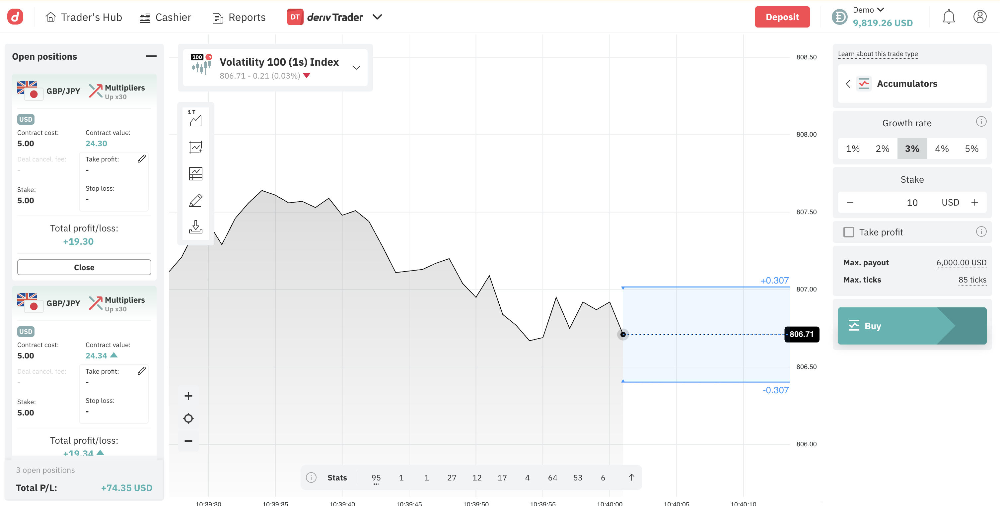

# Amy AI - Dynamic UI Trading Platform

An AI-powered trading platform where the user interface adapts to your needs through natural conversation. Chat with Amy to customize your workspace in real-time.



## Features

### 🤖 AI-Controlled UI
- **Dynamic Layout**: Show, hide, resize, and reorder components through chat
- **Layout Presets**: Trading, minimal, analysis, and monitoring modes
- **Theme & Language**: Switch themes and languages including RTL support for Arabic
- **Context-Aware**: Amy knows your current layout and gives intelligent responses
- **Component Highlighting**: Amy can flash/pulse components to draw your attention during tutorials

### 📈 Real Trading
- **Live Market Data**: Real-time prices from Deriv API
- **Candlestick Charts**: Interactive charts with lightweight-charts
- **Rise/Fall Trading**: Execute binary options trades
- **Position Tracking**: Live P/L updates on open positions

### 🎨 Beautiful Interface
- **Modern Design**: Clean, professional trading UI
- **Dark/Light Themes**: Easy on the eyes, day or night
- **Responsive Layout**: Adapts to different screen sizes
- **Smooth Animations**: Polished user experience

## Quick Start

### Using Docker (Recommended)

```bash
docker-compose up --build
```

Then open:
- **Frontend**: http://localhost:3000
- **Backend**: http://localhost:8000

### Enable AI Mode (Optional)

Set your OpenAI API key for full AI capabilities:

```bash
OPENAI_API_KEY=your-key-here docker-compose up --build
```

Without the key, Amy still works in demo mode with pattern matching.

## Usage

### Chat with Amy

Click the chat bubble in the bottom-right corner and try:

**🎓 Learn Trading (Amy will guide you step-by-step!):**
- "How do I place a trade?" - Interactive tutorial with component highlighting
- "What is Rise/Fall?" - Explains binary options trading
- "Explain the chart" - Learn about any component
- "Show me the order panel" - Highlights components for you

**🎨 Customize Layout:**
- "Hide the news panel"
- "Make the chart bigger"
- "Switch to dark mode"
- "Set up for day trading"
- "What's my current layout?"
- "Change the accent color to blue"
- "Switch to Spanish"

**📚 Get Information:**
- "What are synthetic indices?"
- "How do I connect my account?"
- "Help" - See all available commands

### Connect Your Deriv Account

1. Click "Connect" in the header
2. Enter your Deriv API token (get one from [Deriv API Settings](https://app.deriv.com/account/api-token))
3. Start trading with real money!

**Note**: Without a token, you can still view live prices and charts.

## Components

| Component | Description |
|-----------|-------------|
| **Chart** | Real-time candlestick chart |
| **Order Panel** | Rise/Fall contract trading |
| **Positions** | Open positions with live P/L |
| **Watchlist** | Favorite symbols with prices |
| **Market Overview** | Market summary and trends |
| **News** | Market news and updates |
| **Portfolio** | Account balance and summary |
| **Clock** | World clock with market hours |
| **Calculator** | Trading calculator |

## Layout Presets

- **Trading**: Chart + Order Panel + Positions + Clock
- **Minimal**: Just Chart + Order Panel
- **Analysis**: Chart + Watchlist + News + Market Overview
- **Monitoring**: Positions (large) + Chart + Portfolio

## Tech Stack

### Frontend
- React 18 with TypeScript
- Tailwind CSS for styling
- lightweight-charts for trading charts
- Lucide React for icons

### Backend
- Python FastAPI
- OpenAI GPT-4 (optional)
- Pattern-matching fallback for demo mode

### Infrastructure
- Docker & Docker Compose
- Nginx for production frontend

## Development

### Frontend

```bash
cd frontend
npm install
npm run dev
```

### Backend

```bash
cd backend
pip install -r requirements.txt
uvicorn main:app --reload
```

## API Endpoints

| Endpoint | Method | Description |
|----------|--------|-------------|
| `/` | GET | Service info |
| `/health` | GET | Health check |
| `/chat` | POST | Chat with Amy |

### Chat Request

```json
{
  "message": "Hide the news",
  "layoutState": {
    "components": { ... },
    "theme": "dark",
    "language": "en",
    "accentColor": "#FF444F",
    "healthIssues": []
  },
  "conversationHistory": []
}
```

### Chat Response

```json
{
  "message": "Done! I've hidden the news panel.",
  "uiChanges": [
    { "component": "news", "action": "hide" }
  ]
}
```

## Environment Variables

| Variable | Required | Description |
|----------|----------|-------------|
| `OPENAI_API_KEY` | No | Enables GPT-4 AI mode |

## License

MIT

---

*"The best interface is one that adapts to you, not one you adapt to."*

